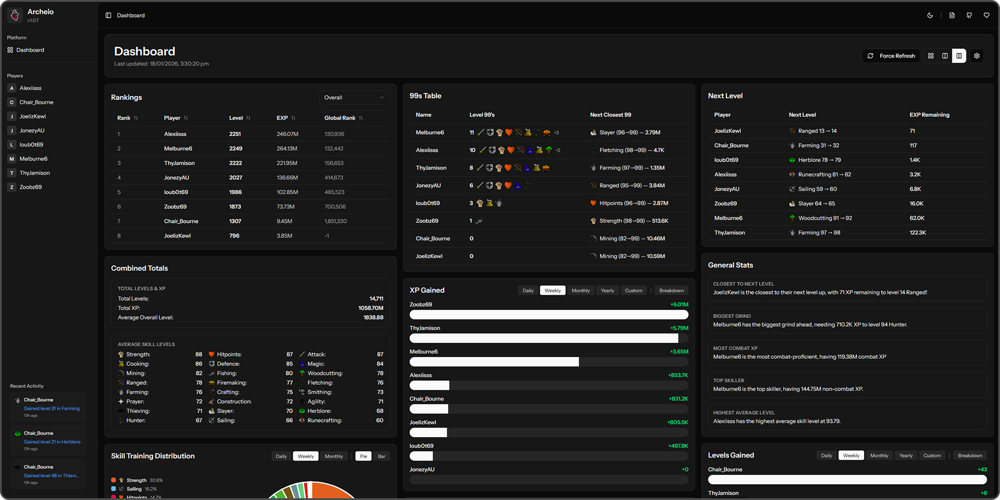

<div align="center">
  
  
  <h1>Archeio - OSRS Player Stats Dashboard</h1>
  
  <h3>
    <a href="https://archeio.zmorehouse.com/">https://archeio.zmorehouse.com/</a>
  </h3>
  A dashboard for tracking Old School RuneScape player statistics.<br/>
Named after everyones favourite <a href="https://oldschool.runescape.wiki/w/Archeio">Arceeus Library Keeper</a>
    <br><br>
  
</div>

## About Archeio
Arechio is a side-project, inspired by [WiseOldMan](https://wiseoldman.net/) and [Runemetrics](https://apps.runescape.com/runemetrics/app/welcome), and looks to store, display and analyse OSRS data.

If you’re familiar with the OSRS Hiscores, you’ll know there’s no historical or persistent data available. Due to the age of the platform, it only exposes current stats, ranks, and experience - once those change, the previous data is lost.

Archeio addresses this by regularly fetching Hiscores data, storing it over time, and presenting it in a way that makes trends, comparisons, and long-term progress visible.

It was originally built for myself and a small group of mates, focusing on group comparisons as well as individual player insights, but it’s flexible enough to be run by anyone who wants to track their own data. As such, feel free to go ballistic with the code. Setup instructions are included below if you’d like to install and run Archeio yourself.

If you'd like a hand setting anything up, feel free to add me on Discord (@zoobzx)

#### A couple of caveats

The OSRS Hiscores API has no built-in persistence. If tracking hasn’t started yet, Archeio can’t show historical progress from before that point.
I have created some basic excel templates if you have existing data you'd like to import into the platform. 

Hiscores data is not truly real-time — stats only update once a player logs out, so Archeio is only as fresh as the data provided by the API.

## Features

- **Group & Individual Player Stats** - Track XP, levels, and skill progress
- **XP Over Time Charts** - Visualize XP gains with line and bar charts
- **Activity Tracking** - Monitor level gains, XP milestones, and achievements
- **Auto-refresh** - Automatically fetch latest stats from RuneScape API
- **Multi-player Support** - Track multiple players simultaneously
- **Customizable Dashboard** - Drag-and-drop component layout

## Tech Stack

- **Backend**: Laravel 12, PHP 8.2+
- **Frontend**: React 19, TypeScript, Tailwind CSS
- **Framework**: Inertia.js
- **Database**: SQLite 
- **Build Tool**: Vite

## Prerequisites

Before you begin, ensure you have:

- PHP 8.2 or higher
- Composer
- Node.js 18+ and npm
- Git

## Quick Start

### 1. Fork This Repository

Click the "Fork" button at the top of this repository to create your own copy.

### 2. Clone Your Fork

```bash
git clone https://github.com/YOUR_USERNAMEarcheio.git
cd archeio
```

### 3. Install Dependencies

```bash
# Install PHP dependencies
composer install

# Install Node.js dependencies
npm install
```

### 4. Environment Setup

```bash
# Copy the environment file
cp .env.example .env

# Generate application key
php artisan key:generate
```

### 5. Configure Environment Variables

Edit `.env` and set:

```env
APP_NAME="Your OSRS Dashboard"
APP_URL=http://localhost:8000

# Timezone (defaults to UTC, but the app displays times in AEST/AEDT)
# To change the timezone, update config/app.php 'timezone' setting
# Common timezones: 'Australia/Sydney', 'America/New_York', 'Europe/London', 'UTC'
APP_TIMEZONE=UTC

# Database (SQLite is default)
DB_CONNECTION=sqlite
DB_DATABASE=database/database.sqlite

# Or use MySQL for production
# DB_CONNECTION=mysql
# DB_HOST=127.0.0.1
# DB_PORT=3306
# DB_DATABASE=osrs_dashboard
# DB_USERNAME=your_username
# DB_PASSWORD=your_password
```

### 6. Run Migrations

```bash
php artisan migrate
```

### 7. Build Frontend Assets

```bash
# For development
npm run dev

# For production
npm run build
```

### 8. Start Development Server

```bash
php artisan serve
```

## Timezone Configuration

The application displays dates and times in **AEST (Australian Eastern Standard Time)** / **AEDT (Australian Eastern Daylight Time)** by default. This is configured in the frontend code to use the `Australia/Sydney` timezone.

### Changing the Timezone

To change the timezone used throughout the application:

1. **Backend (PHP)**: Edit `config/app.php` and change the `timezone` setting:
   ```php
   'timezone' => 'America/New_York', 
   ```

2. **Frontend (JavaScript)**: Update the timezone in `resources/js/lib/timezone-utils.ts`:
   ```typescript
   // Change 'Australia/Sydney' to your preferred timezone
   const formatter = new Intl.DateTimeFormat('en-US', {
       timeZone: 'America/New_York', // Change this
       // ...
   });
   ```

## Adding Players To Track

### Via Artisan Command

```bash
php artisan players:add "PlayerName1" "PlayerName2"
```

### Fetching Player Stats

Stats are automatically fetched, but you can manually trigger:

```bash
# Fetch stats for all players
php artisan players:fetch-stats
```

### Importing Legacy Data

If you have existing player data, modify the Player_rows.csv and Snapshot_rows.csv files with your data. Then run the following :

```bash
php artisan import:legacy-data Player_rows.csv Snapshot_rows.csv
```

## Deployment

### Laravel Cloud

I have chosen to use Laravel Cloud to deploy my instance. Feel free to use Forge, or another provider - though Cloud proves for a super simple deployment. 

1. **Sign up** at [cloud.laravel.com](https://cloud.laravel.com)
2. **Create a new project** and connect your GitHub repository
3. **Provision and attach a MySQL database to your server** (.env details will import automatically)
4. **Update any missing .env values**
5. **Deploy**
6. **Connect a domain**

**Note**: Make sure to enabled scheduled tasks on your environment, to ensure the fetch is regularly running. 

## Adding New Components

1. Create component in `resources/js/components/dashboard/`
2. Register in `resources/js/lib/component-registry.ts`
3. Add to `resources/js/components/dashboard/component-renderer.tsx`

## API Endpoints

- `GET /api/v1/players` - List all players
- `GET /api/v1/players/{player}` - Get player details
- `GET /api/v1/players/{player}/stats` - Get player stats
- `POST /api/v1/players/refresh` - Manually refresh all player stats

## License

This project is open-sourced software licensed under the [MIT license](LICENSE).

## Credits

- Built with [Laravel](https://laravel.com)
- Frontend powered by [React](https://react.dev) and [Inertia.js](https://inertiajs.com)
- Styled with [Tailwind CSS](https://tailwindcss.com)
- Data from [RuneScape Official Hiscores](https://secure.runescape.com/m=hiscore_oldschool)
